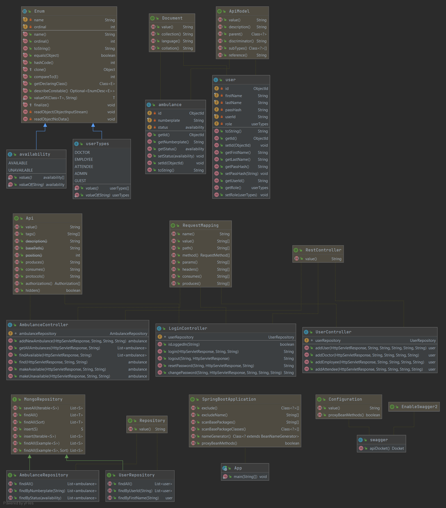

# Ambulance Service Provider
      


This project is a simple hospital management utility providing a  ambulance availability management system for hospitals with following functionalities:
+ Admin related use cases:
    + Add an ambulance to database
    + Make existing ambulances available/unavailable
    + Add Users(Doctors,Attendees,Employees) to the database
    + Reset the passwords of users
    
+ User related usecases:
    + Login
    + See all ambulances present in the system
    + See available ambulances
    + Logout
    + change their password

For Api Documentation: [Visit here](https://asp-swe.herokuapp.com/swagger-ui.html#/) *documented using swagger UI*

Live App deployed on heroku: [here](https://asp-swe.herokuapp.com/swagger-ui.html#/)


## UML (*Implementation Details*)

### Prerequisites
Java jdk v-11 or above installed

A linux or windows environment
### How to run
Download and unzip the source repository for this project, or clone it using Git:

``` git clone https://github.com/KushagraIndurkhya/Ambulance_service_provider```

cd to the root

``` cd Ambulance_service_provider ```

To run the spring app on a linux terminal

``` ./mvnw spring-boot:run```

To run the spring app on a windows command prompt

``` mvnw.cmd spring-boot:run```

To check if the app is running either navigate in the browser or use curl
```curl localhost:8080/actuator/health```

if you see ```{"status":UP}``` then the app is running

### How to build
Download and unzip the source repository for this project, or clone it using Git:

``` git clone https://github.com/KushagraIndurkhya/Ambulance_service_provider```

cd to the root

``` cd Ambulance_service_provider ```

To build the spring app on a linux terminal

``` ./mvnw clean install```

To build the spring app on a windows command prompt

``` mvnw.cmd clean install```

To run the packaged jar file
```java -jar ./target/App-0.0.1.jar```

To check if the app is running either navigate in the browser or use curl
```curl localhost:8080/actuator/health```

if you see ```{"status":UP}``` then the app is running

### Scope of improvement:
+ Sending generated password via email
+ Extend the project to maintain status and availability of rooms and OTs as well


